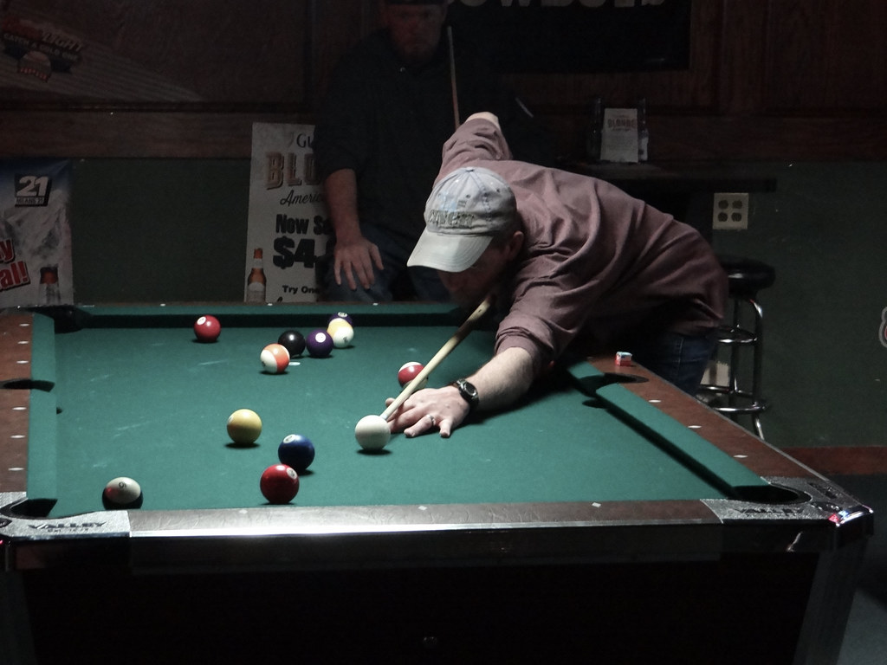

+++
title = 'Pool Rules'
date = 2024-07-12
draft = true
description = 'A comparison of pool rules regularly used in the US.'
# cover.image = ''
cover.hidden = true
+++

I have the opportunity to play pool with some folks that I've
never played pool with before and so I thought it would be timely
to share my ruminations on the pool rules I've experienced
in the US and the rules I recommend for friendly games.

## Bar Pool Rules

The default that I've seen in most bars in the US is that you
shoot 8-ball and you have to
call every shot.  If you call it off of another ball and it goes in
without touching that ball, it is still a miss and you're giving up
control of the pool table.  This can lead to debates on whether
what actually happened adequately matches what was called.  Compared
to other alternatives there is a much higher chance of rules
arguments like this.  Those debates are not fun for me.
It also feels pretty unforgiving and not what
I'd want for a friendly game of pool.

## Accepting Slop

The next logical alternative from bar pool is what I've heard called
slop pool.  As long as your ball goes in it doesn't matter whether
it was what you intended to have happen.  This leads to a much more
relaxed game and there's nothing to argue about, which is a huge
relief.  But it earned the name of slop pool for a reason: it
isn't very competitive and it is would be nice to have some rules
to avoid games that go on forever with defensive battles no one
can win.

## APA League Rules

So if bar pool is too unforgiving and slop pool is too
loosey-goosey, is there a good balance?  Yes!  I present to you:
the APA 8-ball rules.  You can find these rules
[online in various forms](https://www.unlv.edu/sites/default/files/page_files/27/CampusRec_BilliardsRules.pdf), but here is my summary:

* You lag for the break.  You don't have to follow this religiously, but it doesn't hurt to practice.
* While the table is open, you can hit any ball first.  Once you are solids or stripes, you have to hit one of your balls first.
* If you hit your opponent's ball first it is a foul.  If you don't send a ball to the rail after hitting your own ball, it is a foul.
* Fouls and scratches are ball in hand for the other player.  They can put the ball anywhere: there is no "kitchen" to be locked in.
* Beyond that, it is much like "slop" until you get to the 8.  You must mark the pocket where the 8 will go.  Do not ever forget to mark your pocket.  Pick a trinket that isn't the chalk and make it your pocket marker.

After playing way too much pool I've really found this to be a
nice blend of low BS yet challenging with some reasonable limits.
The ball in hand stuff can take some adaption coming from
playing typical bar pool, but it shows up in other games like
9 ball.  Having ball in hand and not being locked in the kitchen
limits how long defensive battles can slog on for.

(image from https://live.staticflickr.com/7286/16562522470_b96eed0f0f_b.jpg
under [CC BY-NC-SA 2.0](https://creativecommons.org/licenses/by-nc-sa/2.0/).)

Whether you're interested in playing league pool or not, these rules
are a fun balance.  There is always a chance that you will find
this fun is something you'll want to get more of and so you might
consider joining your local APA league.  Another advantage of the
APA rules, is that pool halls often use them for their weekend
tournaments.  You usually need to pay a small fee to participate
in the tournament, but often you don't need to be a regular league
player to participate.  This can be a fun way to play against
serious players without committing to the weekly time and
expense of joining the league.  Don't be surprised if teams try
to recruit you.

## Beyond 8 ball

We've focused on 8-ball so far because that is the pool that most
people I've run into are used to.  But there are a myriad of other
options that appear in pool tournaments and can be fun for us to
play who aren't at that level.  One of the things that can be less
fun with 8-ball is when two players are vastly different levels.
The better player will get most of their balls out of the way in
short order and the learning player is left feeling defeated
because you're so far behind the player that has already pocketed
most of their balls.  9-ball addresses this pretty efficiently.
You're never behind in 9-ball.  Whoever is shooting must hit the
low ball on the table first or it is a foul.  If one player
gets most of the balls in, it doesn't matter.  It is helping
both players get closer to the winning ball.  This helps keep it
fun and leads to faster games.  9-ball also encourages you to focus
on where the cue ball is going to end up.  That is a good skill
for any pool game.

## Conclusion

I hope you'll give APA 8-ball a try.  Let me know if you've got
some time to play a game.
