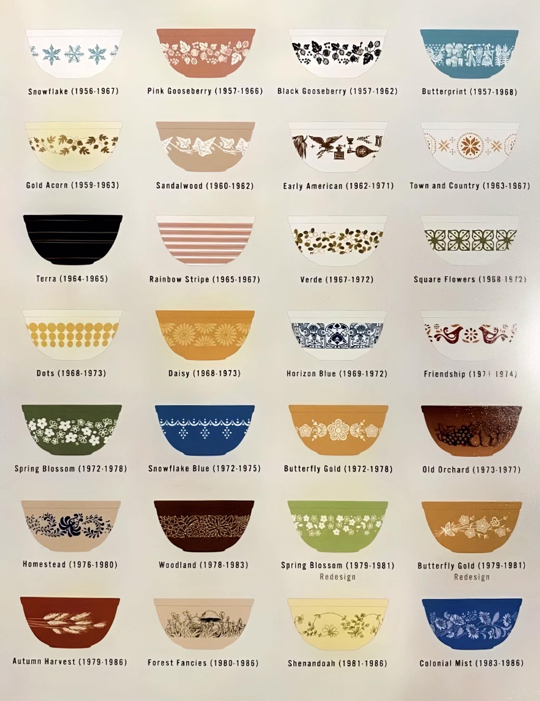

+++
title = 'Pyrex Reference'
date = 2025-09-14
draft = false
+++

## Cinderella Bowls Chart

The Pyrex Cinderella bowls were produced from 1956 to 1987 and remain some of
the most beloved vintage cookware pieces. These nested mixing bowls came in
four sizes with their distinctive angled handles and pour spouts.

## Useful Resources

- **[Pyrex Love](https://pyrexlove.com/)** - Comprehensive database of Pyrex
  patterns, colors, and production dates (seems to be stuck in 2013 though)
- **[Pyrex Passion](https://pyrexpassion.com/)** - Extensive collection
  information and identification guides
- **[Collector's Weekly Pyrex Guide](https://www.collectorsweekly.com/kitchen/pyrex)** -
  Historical overview and collecting tips
- **[What's It Worth?  Pyrex](https://www.replacements.com/crystal-china-silver/pyrex)** -
  Current market values and pattern identification

These resources are invaluable for identifying patterns, understanding
production periods, and determining authenticity of vintage Pyrex pieces.

## Historical Artifacts

[This Pyrex Scientific catalog](https://exhibitdb.cmog.org/opacimages/Images/Pyrex/Rakow_1000132877.pdf)
from 1938 will take you back to a radically different world, less than one hundred years ago.
